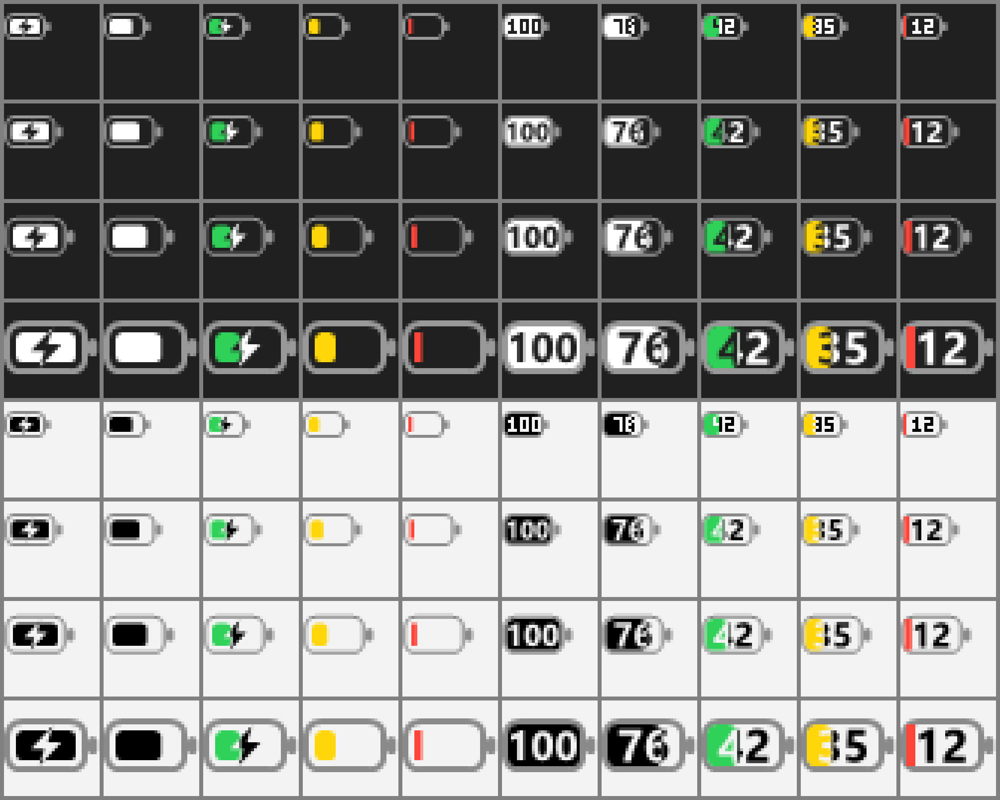

# MacBattery

A macOS-style battery indicator for the Windows system tray.



- Rounded battery glyph with the terminal nub, like the macOS menu bar
- Optional percentage drawn inside the battery, knocked out of the fill
- Green while charging, yellow in Energy Saver, red at 20% or below
- Lightning bolt when plugged in
- Follows the light/dark taskbar theme and display scaling (100%–200%)
- Tooltip and menu show time remaining / charging state
- "Start with Windows" toggle, single `.exe`, no dependencies

## Build

Uses the C# compiler that ships with Windows (.NET Framework 4.x), no SDK required:

```bat
build.cmd
```

## Usage

Run `MacBattery.exe`. Click the tray icon for the menu:

- **Show percentage inside icon**: switch between the plain and the numbered battery
- **Start with Windows**: adds or removes a `HKCU\...\Run` entry
- **Quit**

Windows doesn't let apps replace the built-in battery icon. If you only want this one, hide the system icon
with a tool like [Windhawk](https://windhawk.net/) or drag MacBattery next to the clock.

`MacBattery.exe --preview <dir>` renders every state at every size to `<dir>\preview.png`.
